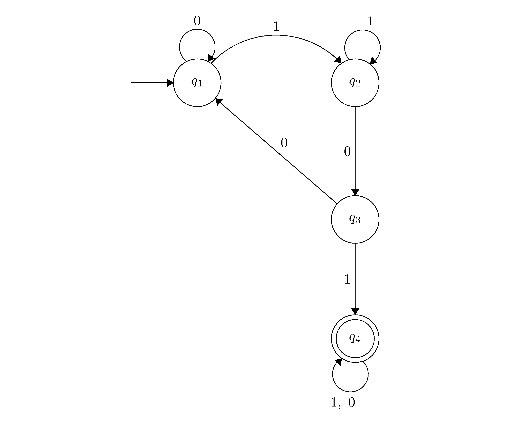
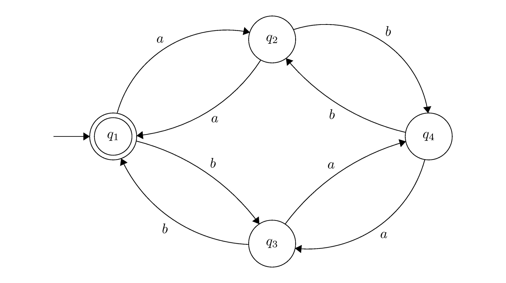

# inferrer: A grammatical inference library

## About inferrer
Inferrer is a grammatical inference library written in python. The library can be
used to learn the grammar of a regular language from a given set of example strings. The
library implements 

* E. Mark GOLD's algorithm,
* The Regular Positive and Negative Inference (RPNI) algorithm, and
* Dana Angluin's L* algorithm.

## Setup
It is assumed that you have [Python 3](https://www.python.org/downloads/release/python-352/) installed on your system.

Clone the repository and then run the unit tests.
```bash
$ git clone https://git.cs.sun.ac.za/18965237/inferrer
$ cd inferrer
$ python3 -m unittest discover
```
Since inferrer is a library, you can import and use it in your own code, but the library
is also exposed via a CLI:
```bash
$ python3 cli.py --help
```

Documentation for the library is located in docs/public/index.html.

## Examples

### Substring example

We want to try and learn the language A, where A is a binary string containing 101 as a substring.
In the resources directory, there is a file positive_01.txt, this file contains positive example
strings and a file negative_01.txt, which contains negative example strings.

We are going to try to learn this regular language using the RPNI algorithm:
```bash
python3 cli.py resources/positive_01.txt resources/negative_01.txt rpni
```
RPNI then builds the following DFA



which is the correct grammar and thus we have successfully inferred the regular language A.
This DFA is then converted to the following regular expression:
```text
(11*00|0)*(11*(0(1(1|0)*)))
```

### Even occurrences
We want to try and learn the language L, where L is a language over the alphabet {a, b} where each string in L contains an even number of a's and an even number of b's.

We are going to try to learn this regular language using the RPNI algorithm:
```bash
python3 cli.py resources/positive_02.txt resources/negative_02.txt rpni
```
RPNI then builds the following DFA



which is the correct grammar and thus we have successfully inferred the regular language L.
This DFA is then converted to the following regular expression:
```text
((10(00)*1|0)(1(00)*1)*(1(00)*01|0)|10(00)*01|11)*
```

## Resources

* [Learning Regular Sets from Queries and Counterexamples](https://www.sciencedirect.com/science/article/pii/0890540187900526)
* [Grammatical Inference: Learning Automata and Grammars](http://www.cambridge.org/gb/academic/subjects/computer-science/pattern-recognition-and-machine-learning/grammatical-inference-learning-automata-and-grammars?format=HB#hUi22RWdy3vfxPdp.97)
